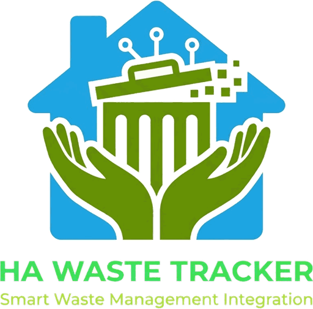

<p align="center">
  <picture>
    <!-- The wordmark is dark green and disappears on a dark ground, so which
         file is the FALLBACK matters: HACS renders this README inside Home
         Assistant's frontend, which is dark by default, and a renderer that
         drops <source> lands on the . The dark-safe variant is therefore
         the img and the light one is the opt-in source, not the other way
         round. The graphic itself is unchanged in both -- only the wordmark
         is lifted. -->
    <source media="(prefers-color-scheme: light)" srcset="brand/logo.png">
    
  </picture>
</p>

# Waste Collection

A Home Assistant integration for household waste: where the bins are, which
ones are holding waste, and when each stream is collected.

**Devices supported: none.** It reads no hardware, no service and no other
integration's entities. Every input is either a schedule you set or an
assertion a person makes by pressing something.

## What it publishes

**Per stream** (`trash`, `recycling`) — one device each:

| entity | notes |
|---|---|
| `sensor.*_next_pickup` | `device_class: timestamp`. Attributes carry the exact date, `days_until_pickup`, `next_pickup_type` (`regular`, `holiday`, `override`), `shifted_from` when the date moved, `is_bin_out`, the next four dates (`upcoming`, and `upcoming_detail` with each one's reason), and `gap` — which field is missing when there is no date |
| `sensor.*_last_collected` | stamped by the button |
| `binary_sensor.*_setout_due` | on the day before and the day of. `status` in its attributes carries the case a boolean cannot: a cart still out the day *after* pickup needs bringing in. Also carries `days_until_pickup`, `next_pickup_type` and `is_bin_out` |
| `switch.*_cart_out` | where the cart physically is — not an instruction |
| `button.*_collected` | the truck came: stamps the time and brings the cart in, because that is one event |

**Per receptacle** — a config subentry, so each is its own device you assign to
an area: `switch.*_has_waste`, `sensor.*_last_emptied`, `button.*_emptied`.

Plus two household-level sensors: `sensor.waste_collection_active_receptacles`,
counting the bins holding waste with the longest-waiting named first, and
`sensor.waste_collection_next_pickup` — the soonest pickup of any stream, with
`streams` (which ones come that day), `days_until_pickup`, `next_pickup_type`
and `is_bin_out` (any of those streams' carts at the curb). One tile reads it
instead of comparing two stream sensors.

## Setup

Add the integration, then **Configure** for each stream's pickup day and
cadence, and **Add receptacle** for each bin.

To remove it, delete the config entry. That takes its devices, its entities and
its stored state (`.storage/waste_collection.<entry_id>`) with it; nothing is
left behind and nothing outside the entry is touched.

Every schedule field can be left empty. Nothing is guessed: with no pickup day
the next-pickup sensor is `unknown` and its `gap` attribute says which field is
missing, rather than showing a date nobody chose. The YAML design this replaced
needed a literal `Not set` option for the same reason — an `input_select` with
no `initial` silently takes its first option, so a fresh install read as "trash
goes out Monday", indistinguishable from a configured house.

### Every other week

Set the cadence to every-other-week and give **any date the truck actually
came**. It fixes which week is the on week and nothing else; the resolver snaps
it back to the pickup weekday itself, so "the Friday I noticed them" works fine
for a Wednesday route.

### Holidays

Under **Configure**, the third step takes the dates the trucks do not run and
how far a pickup moves for each. The rule is the one nearly every municipal
calendar publishes: **a pickup in the same Monday-to-Sunday week as a holiday,
on or after it, moves later by one day per such holiday.** A Monday holiday
delays every route that week; a Thursday holiday delays Friday's route and
leaves Wednesday's alone; a holiday on the pickup day itself moves it. Enter a
Sunday holiday as the Monday it is observed on — nothing here guesses at
observance.

A moved pickup stays *upcoming* on its scheduled day and on the day it moved
to, so Wednesday night still says "tomorrow" rather than "next Wednesday".
`next_pickup_type` reads `holiday` and `shifted_from` names the scheduled
date.

The shift is a setting (0–6 days). Zero turns the rule off and keeps the list.

### Overrides

`waste_collection.set_override` moves or skips **one stream's pickup on one
scheduled date** — a route the town rescheduled, or a week recycling did not
run. Overrides are keyed on the date the schedule alone would give, *before*
the holiday rule, so "the 23rd is skipped" means the same thing whether or not
the holiday was entered; and an override wins over the holiday rule on its
date. `next_pickup_type` reads `override`.

## Actions

### `waste_collection.set_schedule`

Sets one stream's pickup day, cadence or every-other-week anchor without
opening Settings.

It exists because the schedule lives in the config entry's **options**, and
options are reachable only through an options flow — a form somebody has to
open in the Settings UI. A dashboard, a wall panel or an automation has
`callService` and nothing else, so without an action the schedule is
unreachable from every surface except Settings. This is the same setting,
reachable from a script.

| Field | Required | Value |
|---|---|---|
| `stream` | yes | `trash` or `recycling` |
| `weekday` | no | `monday` … `sunday` |
| `cadence` | no | `weekly` or `biweekly` |
| `anchor` | no | an ISO date, e.g. `2026-09-04` |

```yaml
action: waste_collection.set_schedule
data:
  stream: trash
  weekday: wednesday
  cadence: biweekly
  anchor: "2026-09-02"
```

**A field left out is not changed.** Sending `null` or `""` clears one. That
distinction is the reason the action reads its input by key presence rather
than truthiness: setting the cadence alone must leave the pickup day where it
was, and setting one stream must leave the other alone.

**What it refuses, and why that is the point.** A weekday or cadence it does
not recognise is rejected, not dropped and not defaulted; so is a call naming
`stream` and no field at all. Home Assistant answers a service call `200` even
when the call did nothing, so a dashboard button is the one surface that cannot
tell a stored schedule from an ignored one — every refusal here comes back as a
real error naming the field and the value. `weekday_index()` in `resolver.py`
is the same rule one layer down: unknown is `None`, never Monday.

Setting a cadence of `biweekly` with no anchor is allowed and is not an error.
It leaves a named gap (`anchor`) that the next-pickup sensor reports, which is
a schedule that is honestly incomplete rather than one silently given a parity
nobody chose.

### `waste_collection.set_holidays`

Replaces the holiday list and/or the per-holiday shift. The list is sent
**whole** — it is the calendar for the year, and sending it whole is how it
stays equal to that calendar. An empty list clears it; a field left out is not
changed.

| Field | Required | Value |
|---|---|---|
| `holidays` | no | a list of ISO dates |
| `holiday_shift_days` | no | `0` … `6` |

```yaml
action: waste_collection.set_holidays
data:
  holidays: ["2026-09-07", "2026-11-26", "2026-12-25", "2027-01-01"]
  holiday_shift_days: 1
```

A date that will not parse is refused naming the value, never dropped: a
holiday silently dropped is a route silently not moved. A bare string is
refused rather than iterated character by character.

### `waste_collection.set_override`

| Field | Required | Value |
|---|---|---|
| `stream` | yes | `trash` or `recycling` |
| `date` | yes | the *scheduled* ISO date |
| `replacement` | one of | the date it happens instead |
| `skip` | one of | `true`: it does not happen |
| `clear` | one of | `true`: forget the override |

```yaml
action: waste_collection.set_override
data:
  stream: recycling
  date: "2026-12-23"
  skip: true
```

Exactly one of `replacement`, `skip` and `clear` — two together contradict and
are refused, none at all is refused, and a replacement equal to the date is
refused as a no-op that would sit in the map claiming to be an override.

## Design

`resolver.py` holds every date answer and **imports nothing from
`homeassistant`**. It also takes no clock — `today` is always passed
in, because a function that reads the clock cannot be tested by inspection, and
"is the truck coming tomorrow" is exactly the question nobody can wait around
to observe.

The test suite runs with Home Assistant **absent**, which is what makes that
claim real rather than documentary: any core import creeping into `const.py` or
`resolver.py` fails collection on the commit that adds it. `validate.yml`'s
`imports` job covers the other half — the real layout against real core, on
Python 3.14, which is what Home Assistant 2026.x requires (`>=3.14.2`); on 3.13
pip silently filters out every 2026.x core release and a job passes against a
2025 one instead.

Nothing here polls anything. The coordinator recomputes every five minutes so a
midnight rollover shows up promptly — `next_pickup` and `setout_due` change
with the date and nothing fires a state change when they do.

Everything is `datetime.date`. The TypeScript this was ported from had to round
its day arithmetic, because a DST boundary makes one span 23 hours and another
25 and a floor turns "in 7 days" into 6 twice a year. Calendar arithmetic has no
such hazard, so the rounding is gone rather than reimplemented — the one
behavioural difference between the two, and a simplification, not a change of
answer.

### Known limitations

A receptacle carries no capacity and no fill level, and `has_waste` is an
assertion by a person rather than a measurement — this integration knows a bin
needs emptying only because somebody said so. There is no pickup-history
series: `last_collected` is one timestamp, not a log.

## Tests

```sh
pip install pytest && ./tools/run_tests.sh
```

CI runs the same script from `.github/workflows/validate.yml`.
